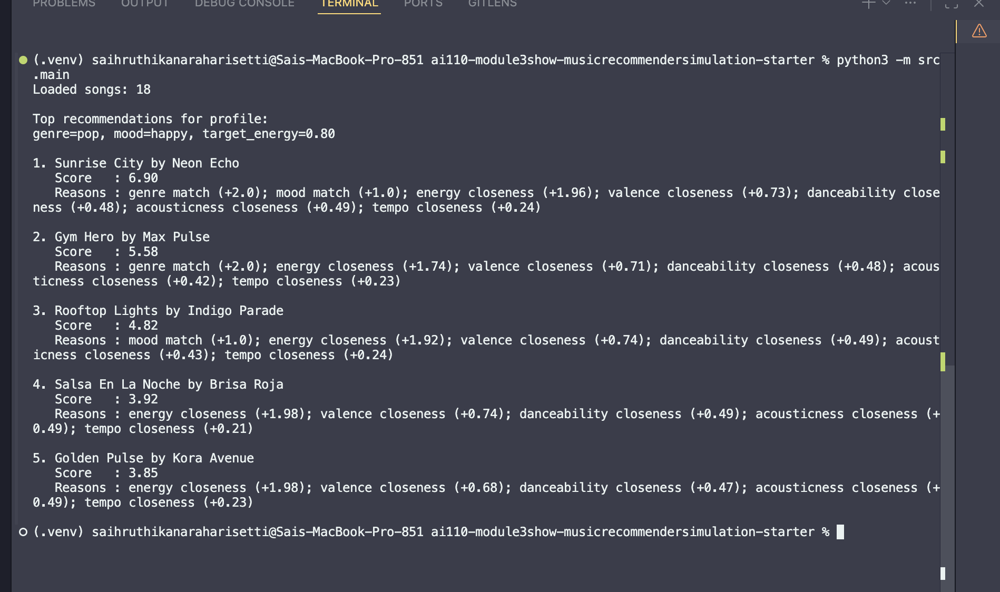
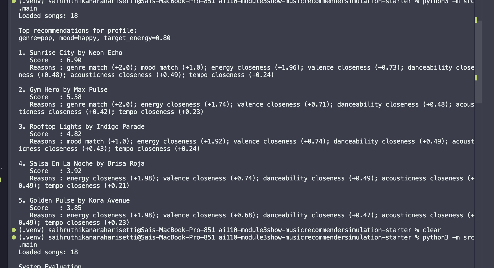
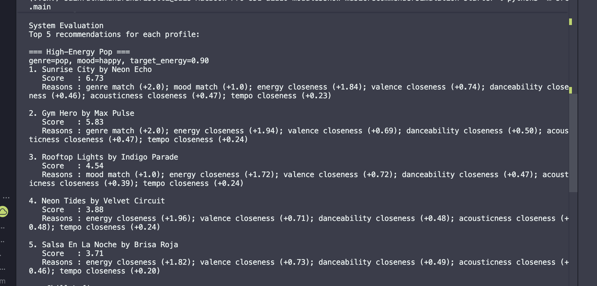
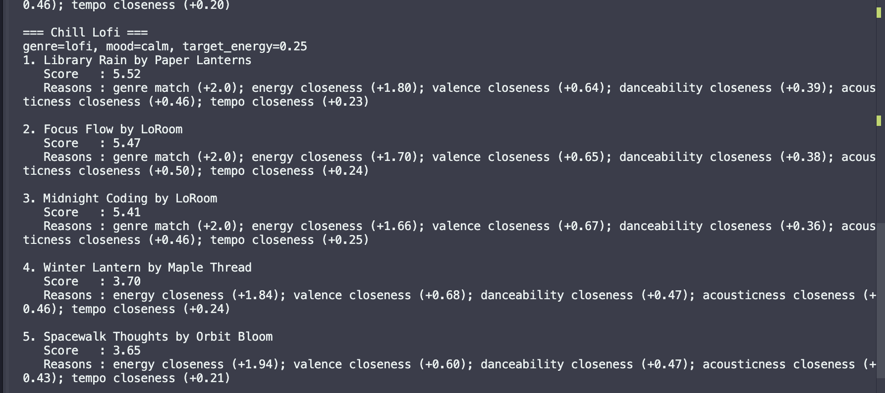
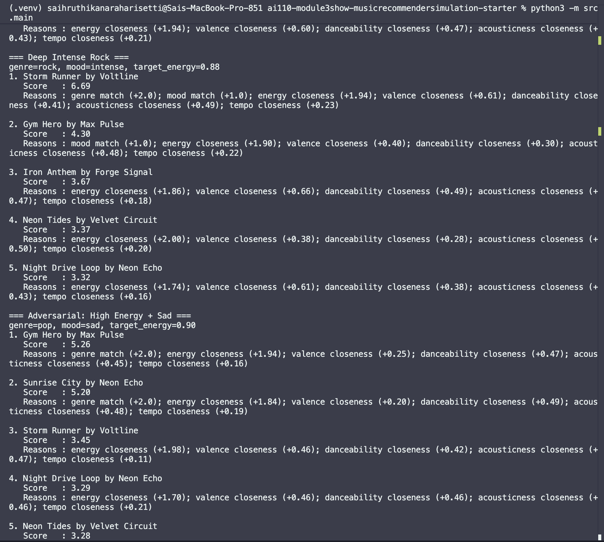

# 🎵 Music Recommender Simulation

## Project Summary

This project is my simplified version of a music recommendation engine. I built a small system that compares each song to a user's taste profile, gives the song a score, and then recommends the highest scoring songs. The goal is not to copy Spotify exactly, but to understand the core logic behind how recommendation systems turn preferences into ranked results.

---

## How The System Works

I designed this as a score-and-rank pipeline. The model loops through every song in the CSV, computes a match score against one user profile, then sorts songs from highest score to lowest score.

### Final Algorithm Recipe

For each song, start at `score = 0` and apply these rules:

- `+2.0` if genre matches `favorite_genre`
- `+1.0` if mood matches `favorite_mood`
- Energy similarity: `+2.0 * (1 - abs(song.energy - target_energy))`
- Valence similarity (tie-breaker): `+0.75 * (1 - abs(song.valence - target_valence))`
- Danceability similarity (tie-breaker): `+0.5 * (1 - abs(song.danceability - target_danceability))`
- Acousticness similarity (tie-breaker): `+0.5 * (1 - abs(song.acousticness - target_acousticness))`
- Tempo similarity (light tie-breaker):
  - `tempo_similarity = 1 - min(abs(song.tempo_bpm - target_tempo_bpm) / 100, 1)`
  - `+0.25 * tempo_similarity`

Then rank all songs by final score and return top `k`.

Why this balance:

- Genre gets more weight than mood because it defines broader taste boundaries.
- Mood still matters, but it is less strict across styles.
- Energy gets strong weight because it captures the main vibe intensity.
- The remaining audio features help break ties between songs that already look similar.

### Data Flow Map

Input (User Prefs) -> Process (Loop over songs, score each one) -> Output (Sorted top K recommendations)


### Potential Biases

This system may over-prioritize genre and miss cross-genre songs that match the user's mood and vibe. It can also favor songs that are very close to one numeric target (like energy) even when a user would realistically enjoy more variety.

### System Evaluation Terminal Output (Screenshots)

Run command:

```bash
python3 -m src.main
```

#### High-Energy Pop


#### Chill Lofi


#### Deep Intense Rock


#### Adversarial: High Energy + Sad


#### Edge Case: Out-of-Range Targets



### Features Used In This Simulation

Song object features:
- id
- title
- artist
- genre
- mood
- energy
- tempo_bpm
- valence
- danceability
- acousticness

UserProfile object features:
- favorite_genre
- favorite_mood
- target_energy
- likes_acoustic

### Prompt To Expand The Dataset

I used this prompt to generate more songs in the same CSV format:

```text
Generate 8 new songs for my recommender dataset in valid CSV format.

Use exactly these headers and this order:
id,title,artist,genre,mood,energy,tempo_bpm,valence,danceability,acousticness

Rules:
- Continue id numbering from 11.
- Return only CSV (header + rows), no explanation.
- Keep energy, valence, danceability, acousticness between 0.00 and 1.00.
- Keep tempo_bpm between 50 and 190.
- Make titles and artists unique.
- Use genres and moods that are not already in my starter data.
- Keep each row realistic (for example, very acoustic tracks should usually not have extremely high danceability).
```

### Extra Numerical Features To Add Later

To make the simulation richer, these features would help:

- instrumentalness (0.0-1.0): how likely the track has no vocals
- liveness (0.0-1.0): how much it sounds like a live recording
- speechiness (0.0-1.0): spoken-word density
- loudness_db (-60 to 0): perceived loudness
- popularity_score (0-100): simulated mainstream appeal
- novelty_score (0.0-1.0): how different a song is from recent listening history
- complexity (0.0-1.0): rhythmic or melodic complexity
- warmth (0.0-1.0): perceived analog or warm sonic character

---

## Getting Started

### Setup

1. Create a virtual environment (optional but recommended):

   ```bash
   python -m venv .venv
   source .venv/bin/activate      # Mac or Linux
   .venv\Scripts\activate         # Windows
  ```

2. Install dependencies

```bash
pip install -r requirements.txt
```

3. Run the app:

```bash
python -m src.main
```

### Running Tests

Run the starter tests with:

```bash
pytest
```

You can add more tests in `tests/test_recommender.py`.

---

## Experiments You Tried

Use this section to document the experiments you ran. For example:

- What happened when you changed the weight on genre from 2.0 to 0.5
- What happened when you added tempo or valence to the score
- How did your system behave for different types of users

---

## Limitations and Risks

Summarize some limitations of your recommender.

Examples:

- It only works on a tiny catalog
- It does not understand lyrics or language
- It might over favor one genre or mood

You will go deeper on this in your model card.

---

## Reflection

Read and complete model_card.md:

[**Model Card**](model_card.md)

Write 1 to 2 paragraphs here about what you learned:

- about how recommenders turn data into predictions
- about where bias or unfairness could show up in systems like this

